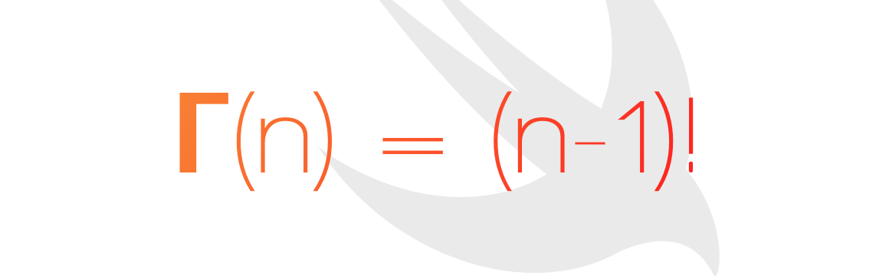

<h1 align="center">
	
	<br>
	<br>
</h1>

<br>
<br>

<p align="center">
	🔢 gamma function (Γ) from mathematics in Swift 🔢
<br>
<br>

<a href="https://swift.org">
    
</a>

<a>
    
</a>

<a>
    
</a>

<a href="https://travis-ci.org/ythecombinator/GammaFn">
    
</a>

<a href="https://codebeat.co/projects/github-com-ythecombinator-gammafn-master">
    
</a>

<a href="LICENSE.md">
    
</a>

</p>
<br>

---

## 📚 Table of Contents

<!-- DO NOT EDIT THE COMMENTS BELOW -->

<!-- toc -->

- [Installation](#-installation)
- [Getting Started](#-getting-started)
- [License](#️-license)

<!-- tocstop -->

## 📦 Installation

You just need to add this package as a dependency in your `Package.swift`:

```swift
let package = Package(
    name: "MyProject",
    dependencies: [
        .Package(url: "https://github.com/ythecombinator/GammaFn.git", majorVersion: 1),
        // ...
    ]
    // ...
)
```

## 🚀 Getting Started

### `gamma(for: Double) -> Double`

It returns the gamma function over `z`.

> *Note*: Complex ( `ℂ` ) numbers aren't supported–only Reals ( `ℝ` ).

```swift
import GammaFn

// Creating a simple `Double` value which we intend to pass to our Γ function–which is a static method from `Double`:

let simpleValue1: Double = 6.0
let resultValue1 = Double.gamma(for value: simpleValue1)
// => 120.0000000000002

// Another valid approach is accessing the property `gammaValue` from any `Double` value:

let simpleValue2: Double = 12.0
let resultValue2 = simpleValue2.gammaValue
// => 39916800.00000004
```

### `logForGamma(of: Double) -> Double`

It returns the natural log of the gamma function for `z`.

> *Note*: This function is used internally by the [spouge approximation](https://en.wikipedia.org/wiki/Spouge's_approximation) to compute large values.

```swift
import GammaFn

// Creating a simple `Double` value which we intend to pass to our Γ function–which is a static method from `Double`:

let simpleValue3: Double = 9.0
let resultValue3 = Double.gamma(for value: simpleValue3)
// => 10.64917311666183

// Accessing the property `logValueForGamma` from any `Double` value is valid as well:

let simpleValue4: Double = 112.0
let resultValue4 = simpleValue4.logValueForGamma
// => 415.0403783916892
```

## ⚖️ License

[GammaFn](https://github.com/ythecombinator/GammaFn) is distributed under
the MIT License, available in this repository.

All contributions are assumed to be also licensed under the same.
